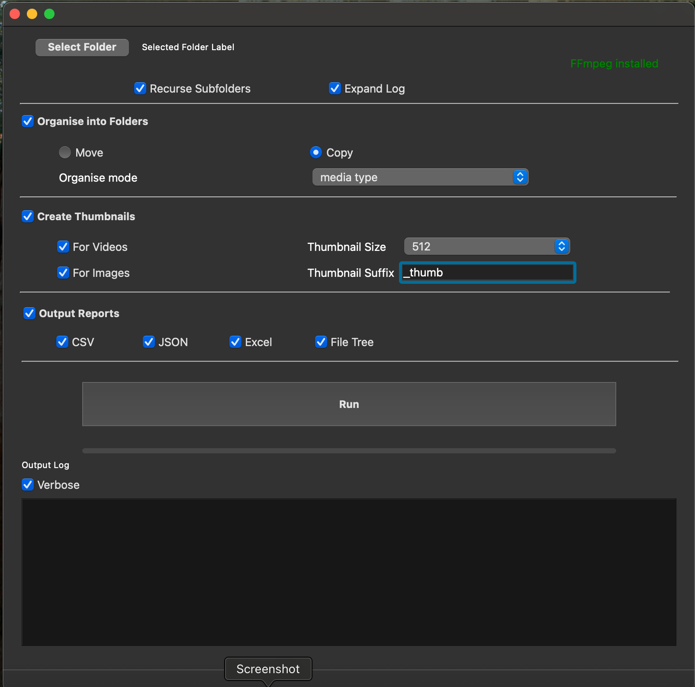

# Smart File Wrangler 
Python Automation for Media Pipelines

**Smart File Wrangler** is a powerful, modular Python automation tool designed to tame the chaos of media-heavy folders. Built specifically for film, VFX, and post-production pipelines, it intelligently identifies file sequences, automates organization, and generates the technical metadata reports and thumbnails needed for a professional workflow.

*Professional media organization at the click of a button.*

---

## 🚀 The Concept
Media pipelines often involve thousands of loose files, complex image sequences, and scattered video assets. **Smart File Wrangler** provides a structured, "safe-fixed" execution pipeline to clean these directories.

Unlike standard file managers, this tool understands **frame sequences** (e.g., `shot_01.[1001-1050].exr`). It treats them as a single media entity for organization, thumbnail generation, and reporting, ensuring your project structure remains clean and readable.

---

## ✨ Key Features

* **Sequence Intelligence:** Automatically detects and groups image sequences, treating them as a single "Media Item" in reports and thumbnails.
* **Flexible Organization:** Choose between **Move** or **Copy** operations within the original directory.
* **Customizable Sort Modes:**
    * **Media Type:** Groups by Video, Audio, Images, or Other.
    * **File Extension:** Sorts by specific formats.
    * **Filename Filter:** Custom "Starts With" or "Contains" logic to target specific naming conventions.
* **Automated Thumbnails:** Generates individual thumbnail files for images and videos using a user-defined horizontal resolution (e.g., 128px to 2048px).
* **Multi-Format Reporting:** Export your folder's "state of play" to CSV, JSON, Excel, or a visual File Tree.
* **Safe Fallback:** Any file that does not satisfy the active filters is automatically placed in an `unsorted` folder.

---

## 📖 Quick Start Guide

1.  **Select Folder:** Click **Select Folder** to set your target directory.
2.  **Configure Tasks:** Toggle the **Organize**, **Thumbnails**, and **Reports** modules as needed.
3.  **Refine Filters:** If using Filename organization, type your criteria into the text box that appears.
4.  **Run:** Hit the **Run** button. A scrolling progress bar will indicate activity while the **Output Log** provides real-time updates.
5.  **Review:** Your organized files and a `thumbnails` folder will be created directly within the source directory.

---

## 🛠 UI Overview

| Feature | Function |
| :--- | :--- |
| **Recurse Subfolders** | Processes all nested directories instead of just the top level. |
| **Expand Log** | Expands the window to reveal the full Output Log for feedback. |
| **Thumbnail Size** | Dropdown to select horizontal resolution (128, 256, 512, 1024, 2048). |
| **Thumbnail Suffix** | Defines a custom string (e.g., `_thumb`) for generated preview files. |
| **Verbose Toggle** | Provides deep, technical CLI-style data in the Output Log. |
| **FFmpeg Status** | Visual indicator (Green/Red) showing if media libraries are detected. |

---

## 🎥 FFmpeg Integration

`ffmpeg` is **not required** to run the tool, but its presence unlocks advanced capabilities.

### If FFmpeg is installed:
* Extract extra **video/audio metadata** (duration, resolution, sample rate).
* Generate **video thumbnails**.
* Generate **one thumbnail for frame sequences** (e.g., `sequence.[1000-1005].png`).

### If FFmpeg is NOT installed:
* These features are skipped automatically without errors or crashes.
* The pipeline continues normally using simple `print()` logging.
* An **Install FFmpeg** button appears in the UI (Red status text).

### Manual Installation Paths
The tool automatically scans the following locations for `ffmpeg.exe`:

* **Windows:**
    * `C:\ffmpeg\bin\ffmpeg.exe`
    * `C:\Program Files\ffmpeg\bin\ffmpeg.exe`
    * `C:\Program Files (x86)\ffmpeg\bin\ffmpeg.exe`
* **Mac:**
    * `/Applications/ffmpeg`
    * `/usr/local/bin/ffmpeg`

> [!IMPORTANT]  
> The program must be **restarted** after a manual FFmpeg installation to recognize the changes.

---

## 📦 Installation

Smart File Wrangler includes standalone installers for desktop use:

1.  Navigate to the `installer` folder in this repository.
2.  **Windows:** Run the `.exe` installer.
3.  **Mac:** Run the `.dmg` installer.

---

## 🤝 Contributing
Smart File Wrangler was built to streamline media production workflows. If you have ideas for new organization modes, report formats, or find a bug, please open an issue or submit a pull request!
